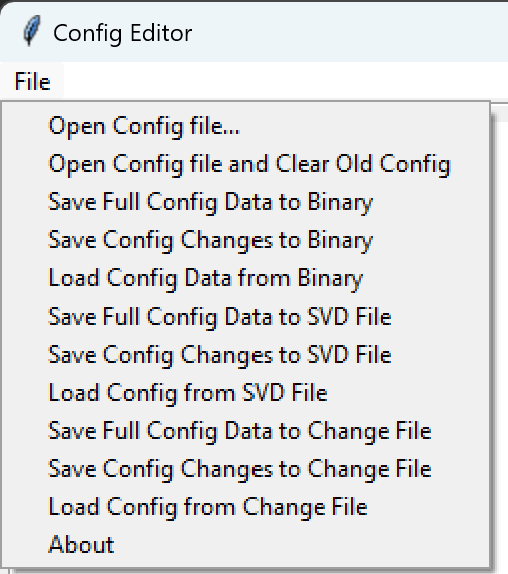

# Configuration Files Specification

## Table of Contents

- [Description](#description)
- [Revision History](#revision-history)
- [Terms](#terms)
- [Introduction](#introduction)
- [YML Specification Differences](#yaml-specification-differences)
- [XML Specification](#xml-specification)
- [Merged YAML and XML Operations](#merged-yaml-and-xml-operations)

## Description

This document is intended to describe the Project MU version of Configuration Files Specification.

## Revision History

| Revised by   | Date      | Changes           |
| ------------ | --------- | ------------------|
| Kun Qin   | 11/29/2021| First draft |
| Oliver Smith-Denny | 7/22/2022 | Add YAML/XML Merged Support |
| Oliver Smith-Denny | 9/15/2022 | Add Profile Support |

## Terms

| Term   | Description                     |
| ------ | ------------------------------- |
| UEFI | Unified Extensible Firmware Interface |

## Reference Documents

| Document                                  | Link                                |
| ----------------------------------------- | ----------------------------------- |
| Slim Bootloader Repo | <https://github.com/slimbootloader/slimbootloader> |
| Configuration YAML Spec | <https://slimbootloader.github.io/specs/config.html#configuration-description-yaml-explained> |
| Project Mu Document | <https://microsoft.github.io/mu/> |
| Configuration Apps Repo | <https://windowspartners.visualstudio.com/MSCoreUEFI/_git/mu_config_apps> |

## Introduction

As Project MU inherits tool set from Slim Bootloader repository to support setup variable feature, certain modifications
has been made to improve workflow and architectural abstraction.

Although the syntax of configuration YAML files mainly follow Slim Bootloader specification for design simplicity, this
document mainly listed the differences between Project MU version and original Slim Bootloader. Additionally, this document
describes the XML format that will be accepted.

## YAML Specification Differences

- All UI related form fields (i.e. `name`, `type`, `help`, etc.) should be described separately from the data definitions.

- The UI form set should be named as `*_UI` following the same directory/name of data form sets (see example below). The
intention of this separation is to allow cleaner YAML layout for platform configuration template creation while maintaining
the [ConfigEditor.py](../../Tools/ConfigEditor.py) capability of updating configuration offline.

```bash
  CfgDataDef.yaml
  CfgDataDef_UI.yaml
  | Template_USB.yaml
  | Template_USB_UI.yaml
```

- For each configuration yaml file set, the data blob header is no longer required. This will be automatically populated
by the [GenCfgData.py](../../Tools/GenCfgData.py). The total size will be rounded up to *4KB* aligned boundary by used
size.

- All `CFGHDR_TMPL` can be ignored from YAML files. Instead, use a `IdTag` to denote a normal ID tag value, or `ArrayIdTag`
to denote an array ID tag value. [GenCfgData.py](../../Tools/GenCfgData.py) will automatically populate the `CFGHDR_TMPL`
content to backend database and generate the same binary data blob.

## XML Specification

See [sampleschema.xml](../../Tools/sampleschema.xml) for an example XML schema.

Configuration will be organized in namespaces, each consisting of various knobs. Knobs may be built of children knobs
or be a leaf knob.

The XML and artifacts generated from it are not used by the ConfApp or other UEFI components, but support is given to
visualize the XML for scenarios that have XML configuration.

Supported data types are:

- uint8_t
- int8_t
- uint16_t
- int16_t
- uint32_t
- int32_t
- uint64_t
- int64_t
- float (note that floats are imprecise, doubles are recommend to avoid rounding errors)
- double
- bool

## Config Editor Operations



All of these options except for Load Config File are only available after one or more configuration files have been
loaded.

### Variable List Binaries

As described in (#merged-yaml-and-xml-operations), the Config Editor can output variable list binaries. These are
created by the [GenSetupDataBin.py](../../Plugins/GenSetupDataBin/GenSetupDataBin.py) build plugin to generate
profiles (see the [Profiles](../Profiles/Overview.md) doc for more information).

- Save Config Data to Var List Binary:
  Create a variable list binary to be used for testing or to load later in the Config Editor tool
- Load Config Data from Var List Binary:
  Load a saved variable list binary (of the same format as the loaded YAML/XML file) into the UI. This can be used
  to load previously stored configuration or validate the output of GenSetupDataBin.py.

### SVD Files

The SVD is intended for use with the UEFI [Conf App](../../ConfApp/), which can take the SVD as input
and give an SVD describing the current UEFI settings as an output. The SVD is formatted to be compatible
with [DFCI](https://github.com/microsoft/mu_plus/tree/release/202202/DfciPkg).

- Save Full Config Data to SVD File:
    Saving the entire defined YAML/XML structure into encoded binary settings format. This format is useful when many
    tags of settings need updating at once, but this will save *all* configurations defined.
- Save Config Changes to SVD File:
    Saving only the changed tag setting into corresponding encoded binary value. This will allow the target system to
    update only the changed tag setting (i.e. Only disable GFX controllers, and leave USB ports on the same system
    intact)
- Load Config Data from SVD File:
    Once the target system has dumped current configuration from ConfApp, the output data can be viewed in
    the ConfigEditor on a host system or saved SVDs from the ConfigEditor can be loaded again.

### Change Files (Delta or CSV)

Profiles are represented as delta files on top of the generic profile (for more info see the
[Profiles](../Profiles/Overview.md) doc). In addition, the XML differences between what is set in the UI and the base
XML can be saved as CSV files.

The UI tool expects the XML file name to be a prefix to the CSV file name. I.e. my_config_1.xml would match with
my_config_1_override_all.csv and my_config_1_some_overrides.csv but not i_overrode_my_config_1.csv. This way the CSV
will be correctly applied to the appropriate loaded XML file.

- Save Full Config Data to Change File
  Save all configuration knobs to the change file, even if they do not have a change over the base YAML/XML. This is
  helpful to see the whole state of configuration from one file.
- Save Config Changes to Change File
  Save only configuration knobs that have a different value from the base YAML/XML to a change file. This is helpful to
  have smaller change files, but looking just at a change file does not describe the whole state.
- Load Config from Change File
  Load a previously save change file into the UI, overwriting any values from the base YAML/XML. It must be loaded onto
  a YAML/XML that has the configuration knobs present in the change file.

## Merged YAML and XML Operations

One YAML and one XML file may be loaded at the same time via the CLI as such:

```bash
python ConfigEditor.py sampleschema.xml samplecfg.yaml
```

When saving config changes to delta files, two files will be output: a .dlt file for the YAML
config changes and a .csv file for the XML config changes. Either or both of these can be later
loaded to modify the current config viewed in the ConfigEditor.

As noted above under YAML Specification Differences, the full SVD can be saved in a merged
configuration. Config will be stored in individual tags under each variable name.

For saving to/loading from a binary file, the merged config will create a list of UEFI variables
that will look as such:

|   XML Var 1  |
|   XML Var 2  |
|      ...     |
|   XML Var N  |
|   YML Var 1  |
|   YML Var 2  |
|      ...     |
|   YML Var N  |

(Order not guaranteed)

Where XML/YML Var N looks like:

|   UINT32   Name Size   |
|   UINT32   Data Size   |
|   CHAR16   \*Name       |
|   EFI_GUID GUID        |
|   VOID     \*Data       |
|   UINT32   CRC         |

YAML only configuration (or XML only) is the same as the above. The ConfApp uses YAML only configuration.
