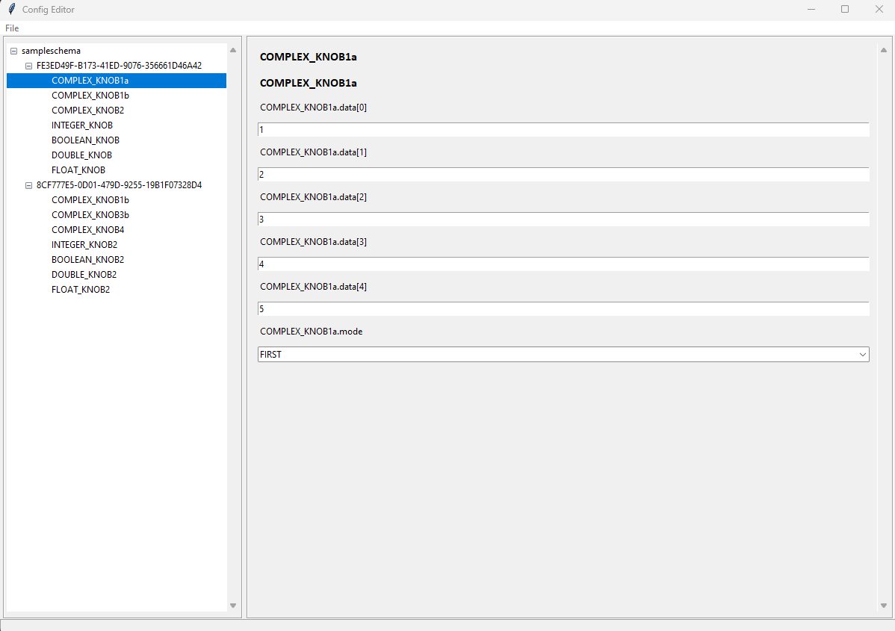
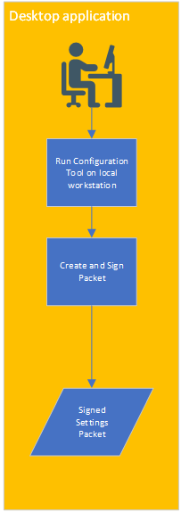
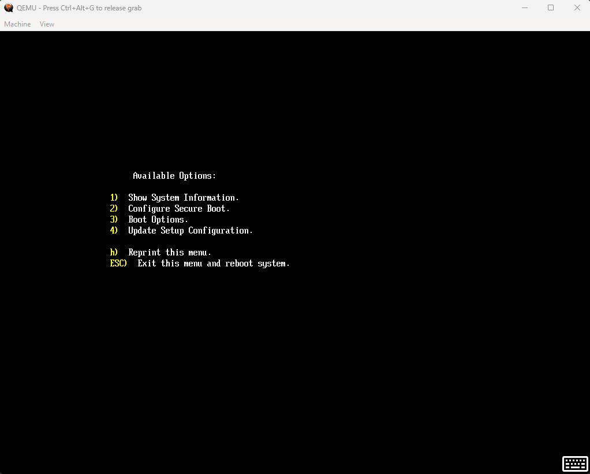
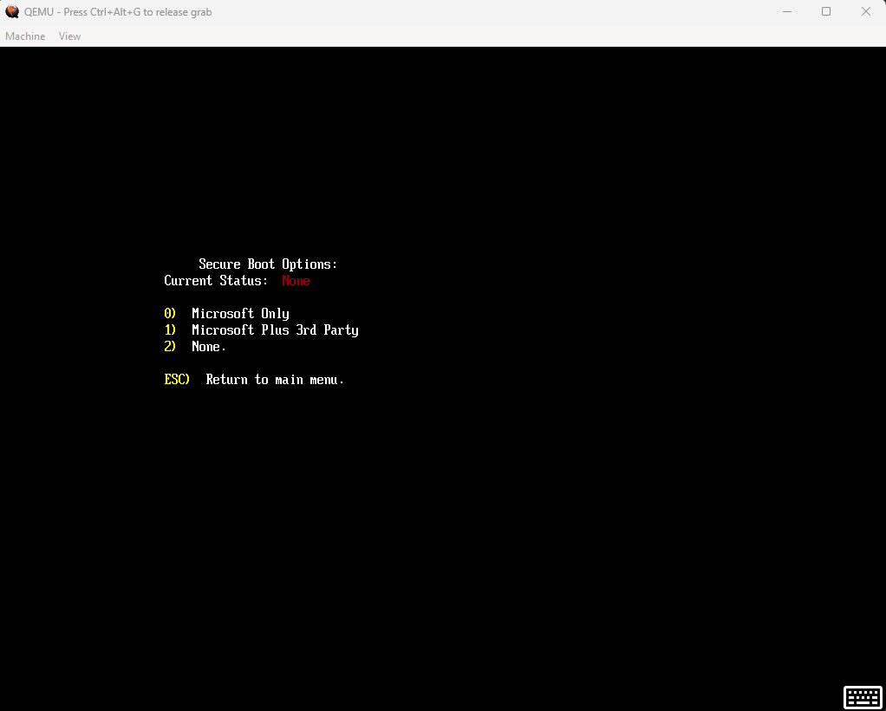
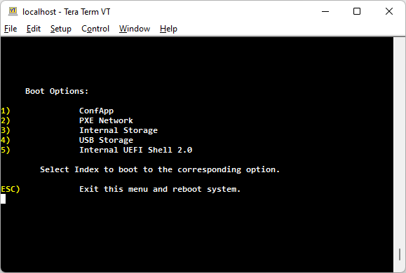
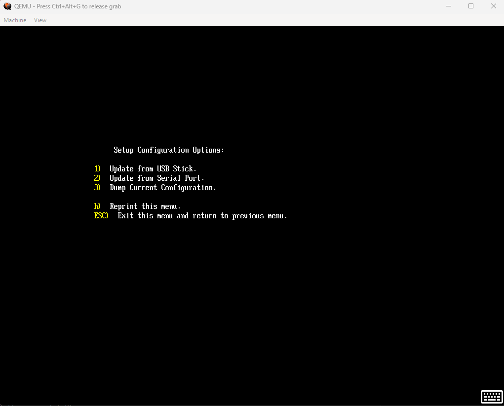
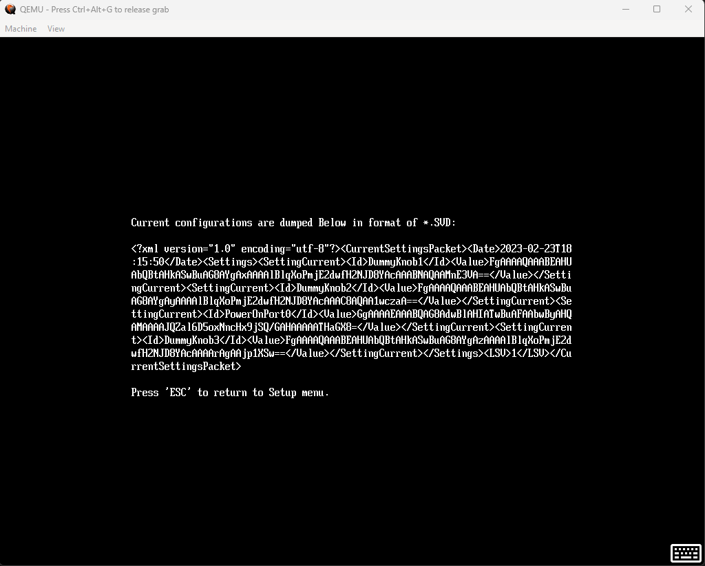

# Configuration Applications Design

## Table of Contents

- [Description](#description)
- [Revision History](#revision-history)
- [Terms](#terms)
- [Reference Documents](#reference-documents)
- [Introduction](#introduction)
- [Configuration Flows](#configuration-flows)
- [Theory of Operation](#theory-of-operation)
- [OS Based Configuration App](#os-based-configuration-app)
- [UEFI Conf Shell Application](#uefi-conf-shell-application)
- [UEFI Build Plugin and Headers](#uefi-build-plugin-and-headers)
- [Profiles](#profiles)

## Description

This document describes the configuration knob flow for consumers of mu_feature_config. This is an opinionated approach
to managing platform configuration with reusable core functionality, standard interfaces, and a layered approach to
setup config.

## Revision History

| Revised by   | Date      | Changes           |
| ------------ | --------- | ------------------|
| Kun Qin   | 09/28/2021| First draft |
| Oliver Smith-Denny | 7/22/2022 | Add Merged YAML/XML Support |
| Oliver Smith-Denny | 9/15/2022 | Add Profile Support |
| Oliver Smith-Denny | 2/21/2023 | Move to XML Spec |

## Terms

| Term   | Description                     |
| ------ | ------------------------------- |
| UEFI | Unified Extensible Firmware Interface |
| BDS | Boot Device Selection |
| FW | Firmware |
| FMP | Firmware Management Protocol |
| HII | Human Interface Infrastructure |

## Reference Documents

| Document                                  | Link                                |
| ----------------------------------------- | ----------------------------------- |
| Project Mu Documentation | <https://microsoft.github.io/mu/> |

## Introduction

Classic setup configuration workflows use HII and FW based UI menus to configure knobs. These approaches are convoluted
and are not easily ported across platforms as they contain very platform specific code. In addition, in many
environments, a UI based configuration menu is inconvenient and not scalable, such as in a server system, where an
administrator may be trying to update settings across 10,000 nodes.

This document describes the mu_feature_config approach to a scalable, portable, and extensible configuration system
using a data centric model to flow data between core, platform, and silicon components.

In addition, tooling workflows are introduced to manage the end to end configuration flow, from changing a knob to
applying it in a target system.

mu_feature_config is targeted at platforms where
[DFCI](https://microsoft.github.io/mu/dyn/mu_feature_dfci/DfciPkg/Docs/Dfci_Feature/) is not applicable, primarily
where the concept of owners and managed systems is not used.

Project Mu does not require the use of mu_feature_config, however this is the recommended approach to using config
with project Mu.

## Configuration Flows

## Theory of Operation

Project Mu's configuration model provides a flexible way for a platform to define and modify configuration knobs. These
knobs are kept in memory in Policy Service, so the option is available to the OEM/platform to have statically defined,
unchangeable configuration knobs (by not consulting variable storage when constructing the config/silicon policies).
There exists support for multiple configuration profiles that may be chosen at run time.

It is expected that multiple silicon components run in early PEI to publish default silicon policies for a given
subsystem. At the same time (or at least without a dependency between the two) the OEM Config Policy Creator runs to
consume the autogenerated config data from the platform and convert it to a config policy.

Following the OEM Config Policy Creator and the default silicon policy producers, one or more Config Policy to Silicon
Policy mappers is expected to run, to convert, in a platform specific way, the config policy to silicon policy. This is
not necessarily 1:1, as in the case where the silicon policy may have 4 USB knobs, but the config policy only has 2, as
this is all that is exposed to the user.

Following this, each final consumer simply interacts with the relevant silicon policy to that component that has been
overridden by the config policy to silicon policy mapper. This may be through autogenerated getters if using verified
policy or by directly accessing structures returned from Policy Service.

## OS Based Configuration App

### OS Configuration App Overview

- The GUI configuration editor is derived from the open source project Slim Bootloader. This framework provides
a graphical user interface on the host side and extensive flexibility to design and optimize configuration per platform
usage.
- [Config Editor](../../Tools/ConfigEditor.py) is authored in Python which is host platform architecture independent and
easy to update to accommodate addition needs.
- The configuration is driven by XML files, which can be designed per platform usage. Reference the
[Configuration XML Spec](../ConfigurationFiles/ConfigurationFiles.md) for details on the schema.
- The mu_feature_config framework provides data structure conversion tooling from XML to C header files, binary, change
files, and SVD format (base64 encoded to send via serial to Conf App).

### OS Configuration Workflow

- To change configuration on a target system, a user can open the relevant XML in Config Editor on their local
workstation.
- In the UI tool, the user can manipulate fields as desired to achieve target config. This can then be saved to a change
file, binary, or SVD.
- The change file can be consumed as a configuration profile. For more details see the
[Profiles doc](../Profiles/Overview.md).
- The variable list binary, saved in .vl format, can be applied to a running system via dmpstore in the EFI shell,
or via [WriteConfVarListToUefiVars.py](../../Tools/WriteConfVarListToUefiVars.py).
- The SVD can be applied to a running system via USB/serial via mu_feature_config's Conf App.
- Changes to the XML itself will result in a change to the default configuration options of a platform.

## UEFI Conf Shell Application

### UEFI Conf Shell App Overview

As stated in the [introduction section](#introduction), this proposal intends to replace the existing UI applications,
HII forms, and other advanced display support. Instead, a Configuration UEFI application will be provided in lieu of
a traditional UI App to configuration system behavior.

- This application is optimized for serial connection. Primary input and output is intended to go through the UEFI
standard serial console.  
- The application will provide basic information regarding system status it receives via FMP:
  1. Firmware version
  1. Date/Time
- A few critical operations is also provided in this application:
  1. Secure Boot enable/disable:
  
  1. Select available boot options:
  
- Apply configuration options from SVD generated from Config Editor:
  
  1. USB Stick
  1. Serial console
- Dump running configuration in SVD format (which can then be loaded on top of an XML in the Config Editor to view).
  
  1. Dump Current Configuration

### UEFI Configuration Workflow

The SVD saved from the Config Editor can be applied via Conf App:

- **USB Stick**: Store the SVD file and select `Update Setup Configuration` -> `Update from USB Stick` from Conf App.
- **Serial Port**: Open the SVD, copy it, and select `Update Setup Configuration` -> `Update from Serial Port` from
Conf App. Then paste the SVD into the serial terminal and hit enter.

## UEFI Build Plugin and Headers

### Plugin and Headers Overview

During UEFI build time, the [UpdateConfigHdr build plugin](../../Plugins/UpdateConfigHdr/UpdateConfigHdr.py) will run,
consume the XML, and produce C header files for config consumers, silicon policy creators, and platform data producers.

All three autogenerated headers will use standard structures defined in
[ConfigStdStructsDef.h](../../Include/ConfigStdStructDefs.h).

The header for consumers will contain stubs for the getters and the platform specific config data structures. This file
is intended to be included before the other two headers files so they may leverage definitions here.

The header for silicon policy creators includes definitions for the getters (indexing into the config policy).

The header for the platform data producer contains the profile and default config data. It is intended to be included in
a platform level driver that just includes the client and data headers so that the OEM level config policy creator
can link in the platform level data. An example is provided in
[mu_oem_sample](https://github.com/microsoft/mu_oem_sample/blob/HEAD/OemPkg/OemConfigPolicyCreatorPei/OemConfigPolicyCreatorPei.c).

Learn more about the UpdateConfigHdr plugin, the generated headers, and the config/silicon policy creators in the
[Platform Integration doc](../PlatformIntegration/PlatformIntegrationSteps.md).

## Profiles

See the [Profiles doc](../Profiles/Overview.md) for details.
