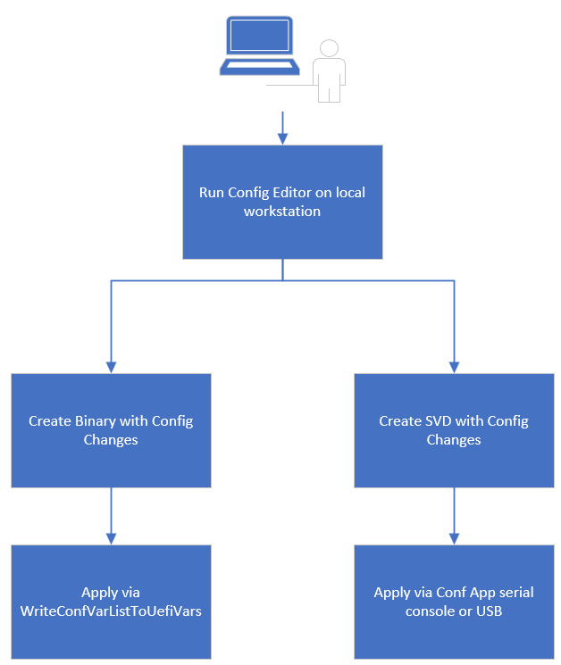
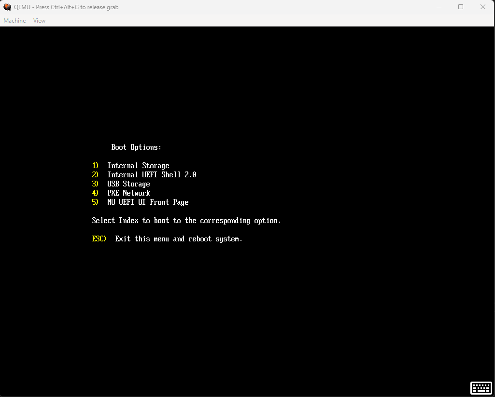

# Configuration Applications Design

## Table of Contents

- [Description](#description)
- [Revision History](#revision-history)
- [Terms](#terms)
- [Reference Documents](#reference-documents)
- [Introduction](#introduction)
- [OS Based Configuration App](#os-based-configuration-app)
- [UEFI Boot Application](#uefi-boot-application)
- [UEFI Build Tool and Plugin](#uefi-build-tool-and-plugin)
- [UEFI Code Change](#uefi-code-change)
- [Configuration Related UEFI Boot Flow](#configuration-related-uefi-boot-flow)

## Description

This document is intended to describe the Setup Variable design on applicable platforms.

## Revision History

| Revised by   | Date      | Changes           |
| ------------ | --------- | ------------------|
| Kun Qin   | 09/28/2021| First draft |
| Oliver Smith-Denny | 7/22/2022 | Add Merged YAML/XML Support |

## Terms

| Term   | Description                     |
| ------ | ------------------------------- |
| UEFI | Unified Extensible Firmware Interface |
| DFCI | Device Firmware Configuration Interface |
| BDS | Boot Device Selection |

## Reference Documents

| Document                                  | Link                                |
| ----------------------------------------- | ----------------------------------- |
| Slim Bootloader Repo | <https://github.com/slimbootloader/slimbootloader> |
| Configuration YAML Spec | <https://slimbootloader.github.io/specs/config.html#configuration-description-yaml-explained> |
| Project Mu Document | <https://microsoft.github.io/mu/> |
| DFCI Documents | <https://microsoft.github.io/mu/dyn/mu_plus/DfciPkg/Docs/Dfci_Feature/> |
| Configuration Apps Repo | <https://windowspartners.visualstudio.com/MSCoreUEFI/_git/mu_config_apps> |

## Introduction

This document is describing how the configuration framework functions and what changes have been made.

The proposition of this design intends to facilitate development usage and provide secure usage for production deployment.

HII in the system, setup browser in system and/or other advance display capabilities has been convoluted and pertain poor
portability. Hence proposed workflow steps away from existing UI applications, HII based form rendering models on the target
system and adopts data centric methods to achieve the same results.

In addition, tooling workflows are also proposed to enforce security and maintainability rules and best practices for data
accessability, version migration, etc.

*Note: The technical details in this document is meant to reflect the current status of design. Certain topics are still
under discussion and subject to change.*

## OS Based Configuration App

### OS Configuration App Overview

- The original framework of configuration editor is derived from Intel's open sourced project Slim Bootloader (more information
in [References](#reference-documents)). This framework provides graphical user interface on the host side and extensive
flexibility to design and optimize configuration per platform usage.
- [Configuration editor](../../../Common/MU_CONF_APPS/SetupDataPkg/Tools/ConfigEditor.py) is authored in Python which is
host platform architecture independent and easy to update per proprietary requirements per projects need.
- The configuration is driven by YAML and XML files, which can be designed per platform usage. Per YAML specification, please reference
to Configuration YAML Spec in [References](#reference-documents).
- The slim bootloader framework provides data structure conversion tooling from YAML to C header files, YAML to binary
data blob out of the box. XML extensions have been added to support additional use cases. More extensions, such as output data signing,
tooling servicing, will be added during the development process.

### OS Configuration Workflow

- Whenever a configuration change is needed, configuration editor can be launched on a local workstation.
- Through the UI tool, one can update supported option as needed and export updated options as binary blob. *Updated options
can also be saved as "profile" that can be loaded into editor tool for faster configuration deployment*
- The exported binary blob will be encoded and signed with platform designated certificates and formatted to DFCI standard
packet. (more about DFCI please see [References](#reference-documents)).
- DFCI standard packets can be applied to target system through USB sticks, OS application on target systems, or serial
transport through UEFI boot application (more about UEFI configuration app [here](#uefi-boot-application))

## UEFI Boot Application

### UEFI Boot App Overview

As stated in the [introduction section](#introduction), this proposal intends to replace the existing UI applications,
HII forms and other advanced display support. Instead, a Configuration UEFI application will be provided in lieu of traditional
UI App to configuration system behavior.

- This application is optimized for serial connection. All input and output would go through UEFI standard console, which
is connected to BMC through UART.  
Note: Available input devices will be:
  1. **Physical USB Keyboard**: This will be used for standard keyboard
  1. **Virtual USB Keyboard**: This will be used with BMC based virtual keyboard for remote KVM.
  1. **Serial console for SAC**: this uses VT100 terminal type for UEFI setup/Windows EMC or SAC.
- The application will provide basic information regarding system status:

  1. Firmware version
  1. Date/Time
  1. Identities
  1. Settings
- A few critical operations is also provided in this application:
  1. Secure Boot enable/disable:
  
  1. Select available boot options:
  
- Apply configuration options from OS configuration application:
  
  1. USB Stick
  1. Network
  1. Serial console

### UEFI Configuration Workflow

With the exported configuration change from OS configuration application, this change can be applied within UEFI app:

- **USB Stick**: Store the generated base64 encoded file from previous step and select `Update Setup Configuration` ->
`Update from USB Stick` from UEFI App.
- **Serial Port**: Open the generated base64 encoded file, and select `Update Setup Configuration` -> `Update from Serial
port` from UEFI App. Then paste the encoded string into serial console.

## UEFI Build Tool and Plugin

### Build Tool and Plugin Overview

During UEFI build time, toolings will be provided as plugins to integrate configuration related data and enforce best practices.

Toolings from Project will cover:

- Converting designed YAML file into binary blob to be included in UEFI firmware volume.
- Generate C header files, if requested, for platform code consumption, and populate version transition templates.

### Build Process

- During pre-build step, customized platform YAML file will be used by Project MU plugin to derive configuration header
files for platform to consume during development/runtime.
- Platform will hold a hash value in PlatformBuild.py for all YAML derived C header files for this platform. Project MU
plugin will generate temporary C header files per build to compare hash match.
  - If hash changed, a template of library will be generated and allow developer to author transition code if needed.
  - If hash match, build can proceed as usual.
- At post-build, a binary blob with default configuration values will be derived from YAML files and inserted in UEFI
firmware volume.

## UEFI Code Change

### Project Mu Code

- **BDS**: Project MU BDS will provide specific event signals and platform entrypoints that are customized for DFCI settings.
- **DFCI**: DFCI framework will be used to accept and validate incoming configuration against platform identity associated
certificates.
- **Settings Manager**: Settings manager together with DFCI framework would apply the configuration data through platform
configured settings providers.
- **Policy Manager**: Policy manager controls the policy publication and revoke. Silicon policy and platform configuration
should all conform to policy setter and getter APIs.

### Platform and Silicon Code

- **Silicon Drivers**: Silicon code needs to be updated to pull policy settings from silicon policy data when needed.
- **Platform Policy Drivers**: Platform owners will first create PEI modules to populate default silicon policy into Policy
managers provided by Project MU.
- **Platform YAML/XML Configurations**: Platform owners should then design the configuration YAML/XML files. This would expose
certain configuration "knobs" from silicon policy to be configurable through setup variable flow.
- **Platform Settings Providers**: Accordingly, platform owners will develop modules to parse the configuration data and
translate the exposed configurations in YAML/XML file to/from standard silicon policies through the interface of Settings
Provider (see example from [Project MU](../../../Common/MU/DfciPkg/Library/DfciSampleProvider/DfciSampleProvider.c)).

## Configuration Related UEFI Boot Flow

- Formatted update configuration data from USB, serial port or OS application will first be stored to UEFI variable storage,
followed by a system reboot.
- Upon next boot, stored formatted variable will be authenticated and decoded by DFCI framework. Decoded configuration
data will be dispatched to corresponding platform authored setting provider.
- Platform configuration setting provider will perform sanity check on incoming data and store this data as UEFI variable
with the following specifications (source code reference [here](../../../Common/MU_CONF_APPS/SetupDataPkg/Include/Library/ConfigDataLib.h)),
followed by a system reboot:

| Variable Name | Variable GUID | Variable Attributes |
| ------------ | ------------------ | ------------------|
| `CONF_POLICY_BLOB` | `gSetupDataPkgTokenSpaceGuid.PcdConfigPolicyVariableGuid` | `EFI_VARIABLE_NON_VOLATILE + EFI_VARIABLE_BOOTSERVICE_ACCESS` |
| `Device.ConfigData.TagID_%08X` | `gSetupDataPkgTokenSpaceGuid.PcdConfigPolicyVariableGuid` | `EFI_VARIABLE_NON_VOLATILE + EFI_VARIABLE_BOOTSERVICE_ACCESS` |

- Upon a new boot, entities other than UEFI can consume the aforementioned variable.
- After entering UEFI firmware, platform policy module will pull previously stored configuration data variable from UEFI
variable and parse the data blob based on YAML derived C header files.
- If any configuration change is required, platform should update the corresponding silicon policy through policy manager.
- When silicon drivers load, these drivers should fetch latest policy through policy manager and configure hardware resource
accordingly.
