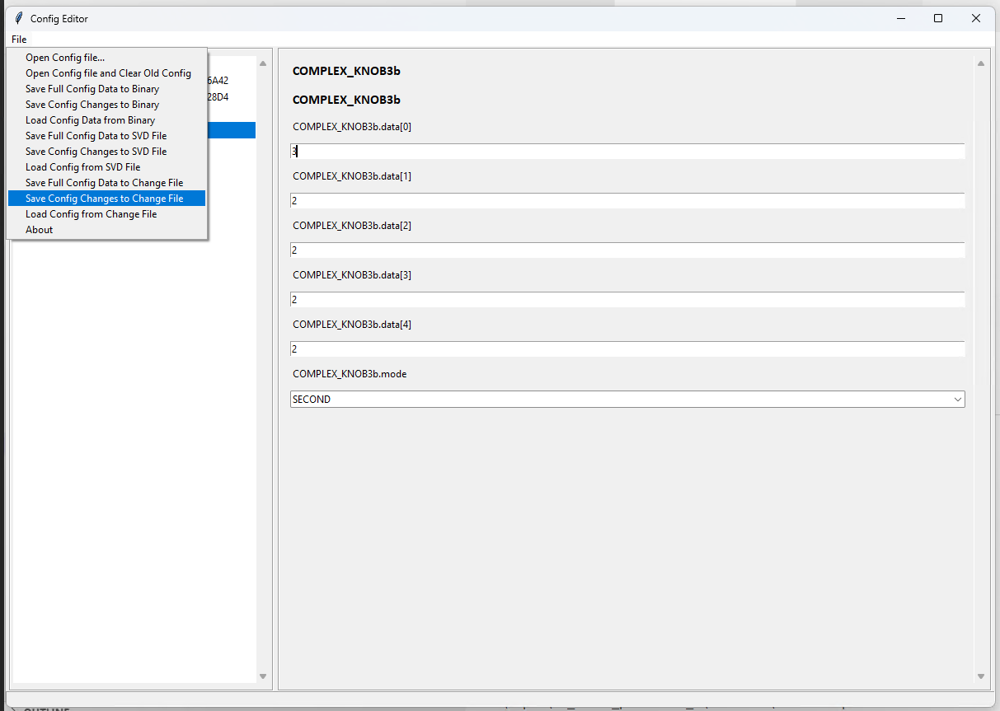

# Configuration Profiles (BIOS Flavors) Implementation

## Table of Contents

- [Introduction](#introduction)
- [Design](#design)

### Description

This document describes the requirements, design considerations and APIs for UEFI Configuration Profiles.

### Revision History

| Revised by   | Date      | Changes           |
| ------------ | --------- | ------------------|
| Oliver Smith-Denny   | 09/15/2022| Initial design |
| Oliver Smith-Denny | 02/27/2023 | XML Spec Update |
| Oliver Smith-Denny | 04/14/2023 | Add XML Profiles |

## Terms

| Term   | Description                     |
| ------ | ------------------------------- |
| UEFI | Unified Extensible Firmware Interface |
| MFCI | Manufacturer Firmware Configuration Interface |
| FV | Firmware Volume |

### Reference Documents

| Document                                  | Link                                |
| ----------------------------------------- | ----------------------------------- |
| MFCI Documentation | [Link](https://microsoft.github.io/mu/dyn/mu_plus/MfciPkg/Docs/Mfci_Feature/)  |
| SetupVariable Flow | [Link](../Overview/Overview.md) |

## Introduction

### Configuration Profiles

UEFI Configuration Profiles, historically called BIOS Flavors, are sets of defined values for UEFI configuration variables.
Such profiles are useful where different owners may use the same hardware but have different requirements for UEFI
configuration variables, such as one owner requiring Secure Boot enabled and SMT disabled and another owner requiring
Secure Boot disabled and SMT enabled. Configuration profiles are provided by the FW as a means to allow both groups to
use the same hardware and FW, but choosing different profiles with the set of configuration they require.

## Design

### Flow

There will be one generic profile that describes the default values for all UEFI configuration variables. This
generic profile will be generated during build time from one XML configuration file specified in PlatformBuild.py as
`MU_SCHEMA_DIR` to the directory path and `MU_SCHEMA_FILE_NAME` as the XML filename. Additional profiles will be
represented as change files (CSV files generated by the [ConfigEditor UI tool](../../Tools/ConfigEditor.py))
specified by `CONF_PROFILE_PATHS` as a space separated string of paths in PlatformBuild.py, e.g.:

```python
self.env.SetValue('CONF_PROFILE_PATHS',
                            self.mws.join(self.ws, 'Platforms', 'PlatformPkg', 'Config', 'Profile1.csv'),
                            self.mws.join(self.ws, 'Platforms', 'PlatformPkg', 'Config', 'Profile2.csv')
)
```

Platform owners can develop a configuration profile for their use case. Following examples and the format provided in
the [ConfigurationFiles doc](../ConfigurationFiles/ConfigurationFiles.md), these owners can create an XML change file
describing the set of configuration variables and their values that are in the profile that differ from the generic
profile. The [ConfigEditor UI tool](../../Tools/ConfigEditor.py) may be used to assist in loading the XML and saving
the output into change files, as well as manipulating the values as necessary.

The profiles will be used as overrides to the generic profile, to be published as the config policy. The profiles will
define the entire set of UEFI configuration variables.

Platform owners will need to update their PlatformConfigDataLib to include `<Generated/ConfigProfilesGenerated.h>`
after including the client and standard headers (for definitions). The profile data is contained within this header file
to be consumed by the OEM/platform config policy creator.

### Profile Update

Profiles will only be added and have values updated during build time.

If a new configuration knob is required to be added to the configuration profile, it must go into the generic profile
with a default value in addition to whichever profiles choose to override it.

If a configuration knob is required to change to a new value with the same structure, it can simply be updated using the
Config Editor UI tool to the new value.

If a new structure is required for an existing configuration knob, then it is required that a new configuration knob
be added, with the old knob being removed as soon as feasible.

### Active Profile Selection

The ActiveProfileIndexSelectorLib library class is intended to be overridden by the OEM/platform to retrieve the active
profile index from the relevant source of truth. If ActiveProfileIndexSelectorLib has a failure fetching the active
profile index, the OEM/platform has the choice of failing to boot, defaulting to the last used profile, or defaulting
to the generic profile.

This index returned is an index into the `gProfileData` structure contained within
`<Generated/ConfigProfilesGenerated.h>`. This will return a `KNOB_OVERRIDE` structure which is a set of overrides to
knobs that can be iterated through and applied to the `CacheValueAddress` of each overridden knob.

Alternatively, if the generic profile is chosen, ActiveProfileIndexSelectorLib will return MAX_UINT32 to indicdate the
gProfileData structure is not used for this boot and instead only the defaults in gKnobData (and possibly any
overrides found in variable storage) will be used.

### Platform Usage Recommendations

#### Generate Profile CSV Files

There are 2 ways to generate the CSV files:

- Through ConfigEditor UI tool:

  - Load the XML configuration file
  - Make any changes
  - Save the CSV file by selecting the "Save Config Changes to Change File" button. Show below:

    

- Through the command line:

  - Run the following command:

    ```bash
    GenNCCfgData  GENCSV  XmlFile[;BinFile]   CsvOutFile
    ```

#### Add Profile CSV Files to PlatformBuild.py

If platforms would like to integrate the profile CSV files into their build, they can add the following to their build by
following the statements outlined in the [section above](#flow).

#### Provide Profile Names and IDs

Platforms also can provide a 2-character name and/or 1-byte ID for each profile. These are used to identify the profile
by the selector, which could be BMC, OS, or other.

In firmware, the name and ID are provided in the `gProfileFlavorNames` and `gProfileFlavorIds`, respectively. Platforms
can elect to create HOBs for these meta data information and provide them to the selector. See example [here](https://github.com/microsoft/mu_oem_sample/tree/release/202302/OemPkg/OemConfigPolicyCreatorPei).

To integrate the name and ID into the build, platforms can add the following to their build by following the statements:

```python
self.env.SetValue('CONF_PROFILE_NAMES', "P2,P1", "Platform Hardcoded")
self.env.SetValue('CONF_PROFILE_IDS', "2,1", "Platform Hardcoded")
```

Note that the profile names and IDs are optional. If they are not provided, the selector will use the profile index as
the default name and ID.
